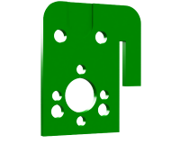
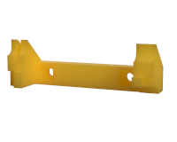
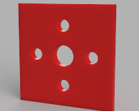

================
DIY Syringe Pump
================

A simple, cheap syringe pump designed for pumping controlled volumes of fluid
onto and off of the PurpleDrop_. It's built from 3D printed custom parts and
off-the-shelf parts from ServoCity_, with a Pololu Tic stepper controller so
that it can be plugged easily into a USB port and controlled using the drivers
from Pololu.

This design was inspired by C.A. Varnon's `open source design <http://cavarnon.com/syringepump>`_.
It's very similar, but a bit more compact, being designed for a smaller stepper
motor and smaller syringe.

The main disadvantage of the design is that there is a significant backlash,
which leads to hysteresis when changing the direction of pumping. For my
application, this is not much of a concern, as each pump will operate in
only one direction. However, it may be an issue in some cases. I think it may
be correctable with the addition of a tension spring between the end-plate and
the "sled", but I haven't tested this. It's probably necessary to get a longer
U-channel in order to accomodate the spring and still be able to actuate the full
plunger depth.

The total cost of parts is about $100.

Control Software
================

The Tic board provides a number of interfaces for controlling the stepper motor.
I use the USB interface, and the pololu provided command line driver.

See the `User's Guide <https://www.pololu.com/docs/0J71>`__ for more details on how
to install, and the available control interface options. I control the motors with
a python wrapper library that runs `ticcmd` via `subprocess` calls. If you have
multiple controllers plugged in, it's easy to control the correct one using their
serial number.

Components
==========

Servo City Parts
----------------

Everything but the stepper motor and the motor controller board is purchased
from servo city.

+----------------+---------------------------------------------------+
| Part Number    | Description                                       |
+================+===================================================+
| 545324_        | Side Tapped Pattern Mount D                       |
+----------------+---------------------------------------------------+
| 545424_        | Side Tapped Pattern Mount B                       |
+----------------+---------------------------------------------------+
| 555164_        | NEMA 11 Stepper Motor Mount                       |
+----------------+---------------------------------------------------+
| 585448_        | U-Channel (9-Hole, 7.5" length)                   |
+----------------+---------------------------------------------------+
| 545311_        | 6mm Lead Screw Nut, 0.77" pattern                 |
+----------------+---------------------------------------------------+
| 4002-0005-0006_| 5mm to 6mm Flexible Clamping Shaft Coupler        |
+----------------+---------------------------------------------------+
| 605630_        | SPDT Miniature Limit Switch with Lever            |
+----------------+---------------------------------------------------+
| 605627_        | Limit Switch Mount D                              |
+----------------+---------------------------------------------------+
| 585474_        | Single Screw Plate (24 pack)                      |
+----------------+---------------------------------------------------+
| 3501-0606-0350_| 350mm 6mm Lead Screw                              |
+----------------+---------------------------------------------------+
| 632176_        | 6-32 0.25" Pan Head Screws                        |
+----------------+---------------------------------------------------+
| 632180_        | 6-32 0.375" Pan Head Screws                       |
+----------------+---------------------------------------------------+
| 632184_        | 6-32 0.5" Pan Head Screws                         |
+----------------+---------------------------------------------------+

The lead screw has to be cut, and one is long enoguh to make two pumps.
It is steel. I cut it in half with a dremel and a cutoff wheel.

Pololu Parts
------------

+----------------+--------------------------------------------+
| Part Number    | Description                                |
+================+============================================+
| 1205_          | Stepper Motor: Bipolar, 200 Steps/Rev,     |
|                | 28×32mm, 3.8V, 0.67 A/Phase                |
+----------------+--------------------------------------------+
| 3133_          | Tic T824 USB Multi-Interface Stepper Motor |
|                | Controller                                 |
+----------------+--------------------------------------------+

.. _PurpleDrop: https://github.com/uwmisl/purpledrop/
.. _ServoCity: www.servocity.com
.. _545324: https://www.servocity.com/nema-11-stepper-motor-mount/
.. _555164: https://www.servocity.com/side-tapped-pattern-mount-d/
.. _545424: https://www.servocity.com/side-tapped-pattern-mount-b/
.. _585448: https://www.servocity.com/7-50-aluminum-channel/
.. _545311: https://www.servocity.com/6mm-lead-screw-nut-0-770-pattern/
.. _4002-0005-0006: https://www.servocity.com/5mm-to-6mm-flexible-clamping-shaft-coupler/
.. _605630: https://www.servocity.com/spdt-miniature-limit-switch-with-lever-2-pack/
.. _605627: https://www.servocity.com/limit-switch-mount-d-2-pack/
.. _585474: https://www.servocity.com/single-screw-plate-24-pack/
.. _3501-0606-0350: https://www.servocity.com/350mm-6mm-lead-screw/
.. _632176: https://www.servocity.com/6-32-zinc-plated-steel-pan-head-screw-25-pack-0-250-1-4/
.. _632180: https://www.servocity.com/0-375-3-8-l-x-6-32-zinc-plated-steel-pan-head-screw-25-pack/
.. _632184: https://www.servocity.com/0-500-1-2-6-32-zinc-plated-steel-pan-head-screw-25-pack/
.. _1205: https://www.pololu.com/product/1205
.. _3133: https://www.pololu.com/product/3133

3D Printed Parts
----------------

The 3D printed parts are designed in Fusion 360. They can all be printed easily
on an FDM printer without support material. Some of them are designed to be
printed in two halves, and glued together with CA glue.

The 3D printed parts are designed for use with BSTEAN 1mL syringes, which I
bought on amazon along with blunt needles to attach to it. These syringes have
a 6.65mm outer diameter, and I suspect that many brands of 1mL syringe will
fit, but I haven't tested others. The 3D printed parts may need some tweaking
to use with different size syringes.

For mounting the Tic controller board to the mount, I drilled holed in the
printed part, and used self tapping screws to mount. Self tapping screws into
PLA isn't an amazingly strong solution -- and don't overtighten them! -- but
it has been fine.

Sled
~~~~

+--------------------+------------------------------------------------+
| |sled_front|       | Design Files:                                  |
|                    |                                                |
|                    | - `STL <models/sled_front.stl>`__              |
|                    | - `STEP <models/sled_front.step>`__            |
+--------------------+------------------------------------------------+
| |sled_back|        | Design Files:                                  |
|                    |                                                |
|                    | - `STL <models/sled_back.stl>`__               |
|                    | - `STEP <models/sled_back.step>`__             |
+--------------------+------------------------------------------------+

Cradle
~~~~~~

+--------------------+------------------------------------------------+
|  Side A                                                             |
+--------------------+------------------------------------------------+
| |cradle_a|         | Design Files:                                  |
|                    |                                                |
|                    | - `STL <models/cradle_a.stl>`__                |
|                    | - `STEP <models/cradle_a.step>`__              |
+--------------------+------------------------------------------------+
|  Side B                                                             |
+--------------------+------------------------------------------------+
| |cradle_b|         |  Design Files:                                 |
|                    |                                                |
|                    | - `STL <models/cradle_b.stl>`__                |
|                    | - `STEP <models/cradle_b.step>`__              |
+--------------------+------------------------------------------------+

Endplate
~~~~~~~~

+--------------------+------------------------------------------------+
| |endplate|         | Design Files:                                  |
|                    |                                                |
|                    | - `STL <models/endplate.stl>`__                |
|                    | - `STEP <models/endplate.step>`__              |
+--------------------+------------------------------------------------+

Controller Mount
~~~~~~~~~~~~~~~~

+--------------------+------------------------------------------------+
| |controller_mount| | Design Files:                                  |
|                    |                                                |
|                    | - `STL <models/controller_mount.stl>`__        |
|                    | - `STEP <models/controller_mount.step>`__      |
+--------------------+------------------------------------------------+

Detailed Images
################

Assembled sled:

Full Assembly:

